# My Cisco Packet Tracer Lab Project

This is my personal documentation for the home lab I built to simulate real network environments using Cisco Packet Tracer and implementing basic network security to protect the environment. In this project I will be demonstrating and learning on how to create a network, what are used and how to secure them.

---

## Step 1: Network Design and Devices Used

So what we will be building is a small office network and we want to separate the Admin, HR and Guest departments and restrict and give access depending on the role.

- Guest **cannot access** Admin or HR
- Admin **can access** everything

So once we open up Cisco Packet Tracer we will be using this devices:

- 1 Router (2911)  
- 1 Switch (2960)  
- 3 PCs  

Rename the PCs:

- PC-Admin  
- PC-HR  
- PC-Guest  

---

## Step 2: Cabling and Physical Topology

Connect everything using Copper Straight-Through cables.

PCs --> Switch  
Switch --> Router  

When you click the PCs using the Copper Straight-Through cables you will asked which port will be used. Select FastEthernet0 and do not choose RS232 or USB0/USB1.

Now when you click the switch, Cisco Packet Tracer will ask which switch port to use, so choose FastEthernet0/1 and so on so forth choose whichever FastEthernet is available. The final output should look something like this:

- PC-Admin --> Fa0/1  
- PC-HR --> Fa0/2  
- PC-Guest --> Fa0/3  

Now connect the switch to the router. Click the Copper Straight-Through cable, then select the switch and choose GigabitEthernet0/1 or whichever is available, then click the router and select GigabitEthernet0/0.

### Screenshots

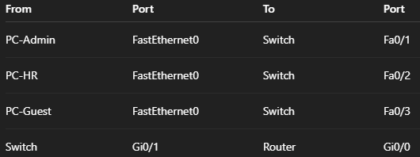  
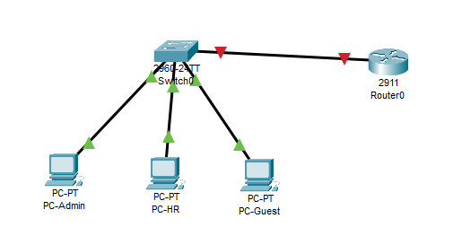

The red triangles from the switch to the router indicates that the link is down and needs configuration.

---

## Step 3: Enabling the Router Interface

By default the router interfaces are shut down so we need to go to Router0 CLI and enable the interface by running this commands:

```
enable
configure terminal
interface gigabitEthernet0/0
no shutdown
exit
```

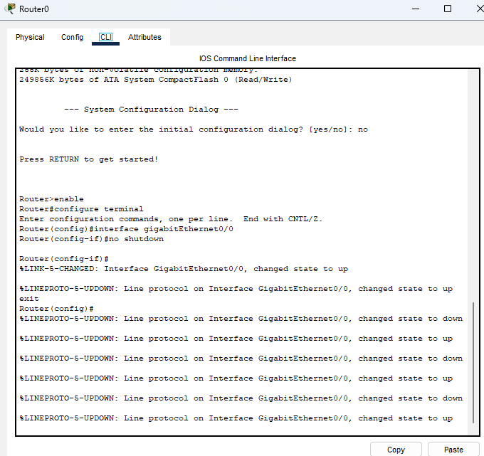

Wait a few seconds for the link to turn green.

The issue should be fixed by now and should look something like this:

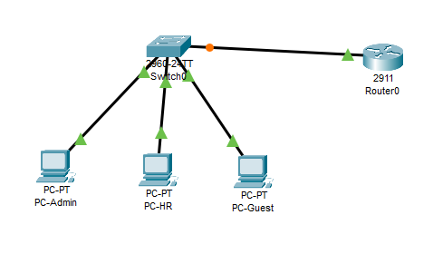

---

## Step 4: Configuring the Switch Trunk Port

Now to setup the switch port as trunk, a trunk port carries multiple VLANs at the same time used between switch and routers or switch and switch so a trunk allows to use one physical cable for multiple VLANs so it makes sure the router isn't confused which VLAN it is.

Now we need to configure the switch port as trunk. Click on Switch0 CLI and run this commands:

```
enable 
configure terminal
interface gigabitEthernet0/1
switchport mode trunk
no shutdown
exit
```

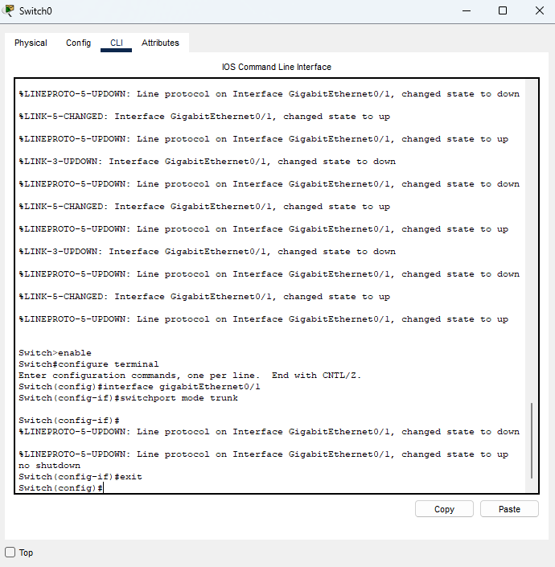

Now wait a few seconds. All links should now be green and all 3 PCs are connected. The physical topology is finished but the VLANs aren't configured yet.

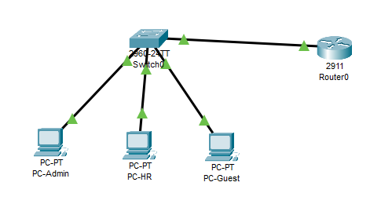

---

## Step 5: Creating VLANs on the Switch

Now we create the VLANs on the switch. First click Switch0 CLI and run this commands:

```
enable
configure terminal

vlan 10
name Admin
exit

vlan 20
name HR
exit

vlan 30
name Guest
exit
```

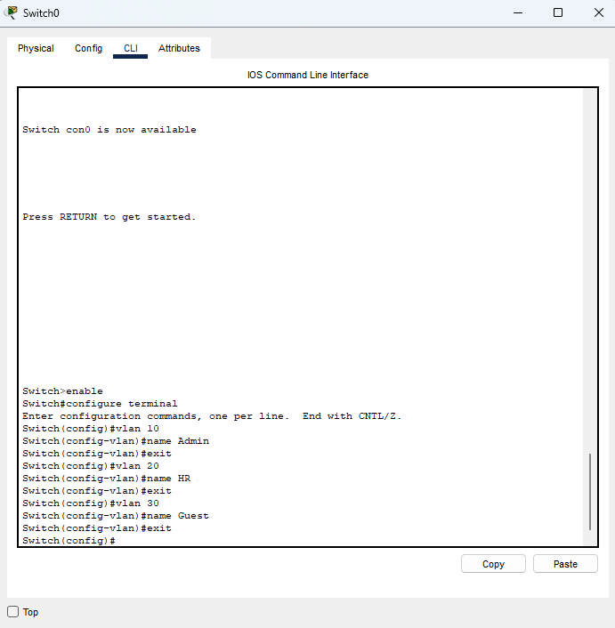  
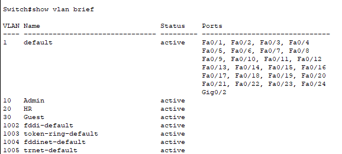

---

## Step 6: Assigning Switch Ports to VLANs

Now we assign switch ports to VLANs to isolate the PCs. Click on Switch0 CLI and input these commands:

**Assign Admin PC (Fa0/1)**
```
interface fastEthernet0/1
switchport mode access
switchport access vlan 10
exit
```

**Assign HR PC (Fa0/2)**
```
interface fastEthernet0/2
switchport mode access
switchport access vlan 20
exit
```

**Assign Guest PC (Fa0/3)**
```
interface fastEthernet0/3
switchport mode access
switchport access vlan 30
exit
```

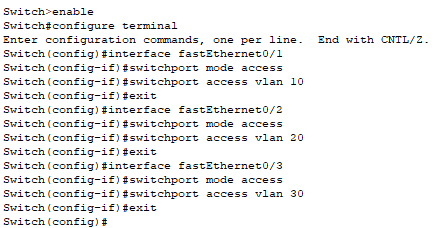  
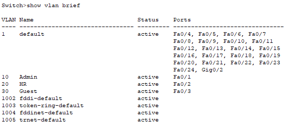

Now we created VLANs on the switch and assigned access ports to isolate them from each other and become separate networks.

---

## Step 7: Router-on-a-Stick Configuration

Now we will be configuring the router since now that the VLANs exist they are isolated and cannot communicate with other PCs in different VLANs so we need to fix that.

Now we will enable the router interface click on router0 cli and run these commands:

```
enable
configure terminal
interface gigabitEthernet0/0
no shutdown
exit
```
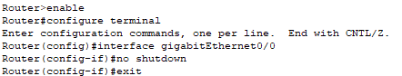

Now we create one sub-interface per VLAN run the following commands:

**VLAN 10 (Admin)**
```
interface gigabitEthernet0/0.10
encapsulation dot1Q 10
ip address 192.168.10.1 255.255.255.0
exit
```

**VLAN 20 (HR)**
```
interface gigabitEthernet0/0.20
encapsulation dot1Q 20
ip address 192.168.20.1 255.255.255.0
exit
```

**VLAN 30 (Guest)**
```
interface gigabitEthernet0/0.30
encapsulation dot1Q 30
ip address 192.168.30.1 255.255.255.0
exit
```

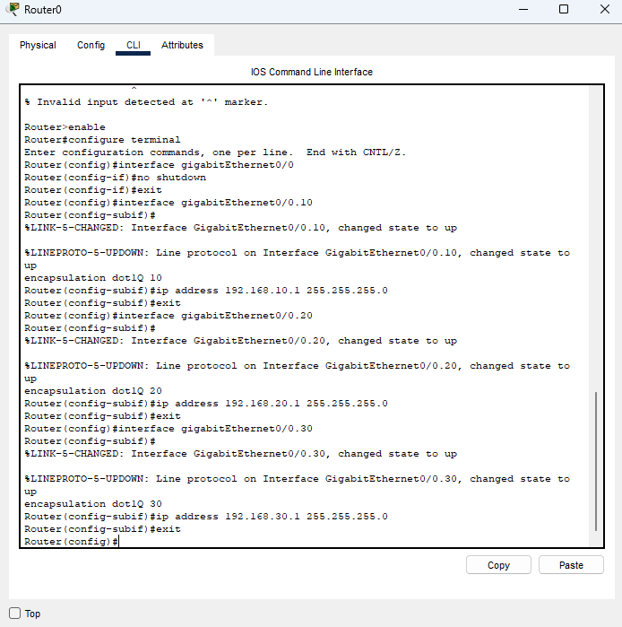

---

## Step 8: Verifying Router Interfaces

Verify the router configuration by running:

```
show ip interface brief
```

You should be able to see:

- g0/0 → up/up  
- g0/0.10 → up/up  
- g0/0.20 → up/up  
- g0/0.30 → up/up  

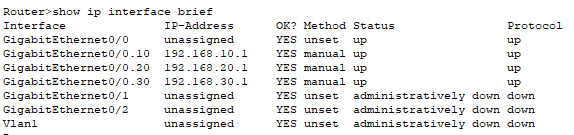
(((((((((((((((((((((((((((((DITO KANA)))))))))))))))))))))))))))))))))))))))))))))
---

## Step 9: IP Address Configuration for PCs

Configure the PCs using the following IP address plan.

**PC-Admin**

- IP Address: 192.168.10.10  
- Subnet Mask: 255.255.255.0  
- Default Gateway: 192.168.10.1  

**PC-HR**

- IP Address: 192.168.20.10  
- Subnet Mask: 255.255.255.0  
- Default Gateway: 192.168.20.1  

**PC-Guest**

- IP Address: 192.168.30.10  
- Subnet Mask: 255.255.255.0  
- Default Gateway: 192.168.30.1  

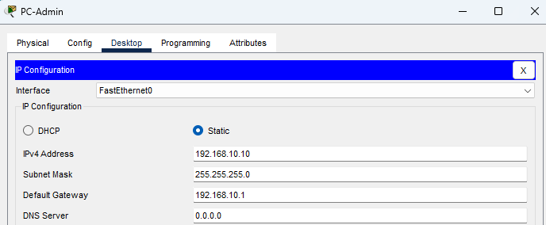

---

## Step 10: Connectivity Testing (Before ACLs)

From PC-Admin, test connectivity:

From PC-Guest, test:

This should work for now because we haven't implemented security rules yet.

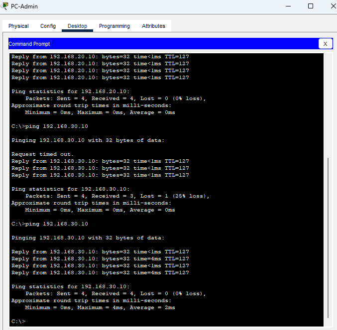

---

## Step 11: Implementing ACLs

Now we add ACLs to block Guest VLAN access to Admin and HR while allowing everything else.

Apply the ACL:

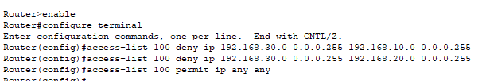  
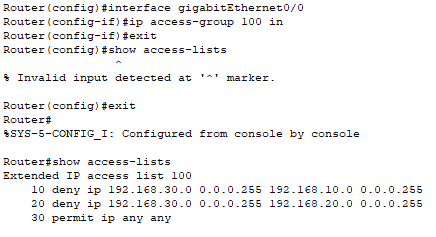

---

## Step 12: ACL Issues and Troubleshooting

I encountered an issue where Guest could still ping Admin and HR. To fix this, I moved the ACL to VLAN 30.

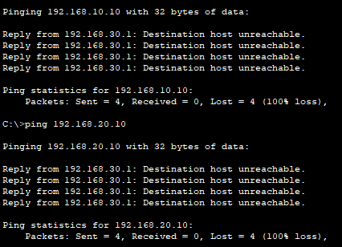

This caused another issue where Admin could not ping Guest due to ping being two-way traffic and ACL being applied inbound.

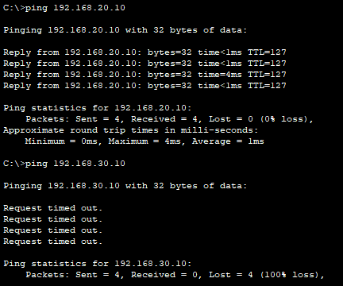

---

## Step 13: Improving the ACL Logic

To allow Admin to Guest communication but block Guest to Admin and HR, I modified the ACL:

---

## Step 14: Final Testing and Completion

**Admin to Guest**

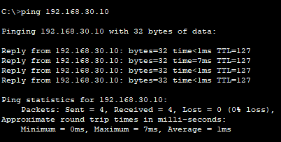

**Guest to Admin**

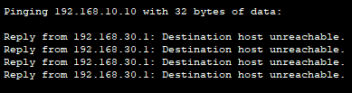

Now everything is set and we have now created a simple secure small network.


